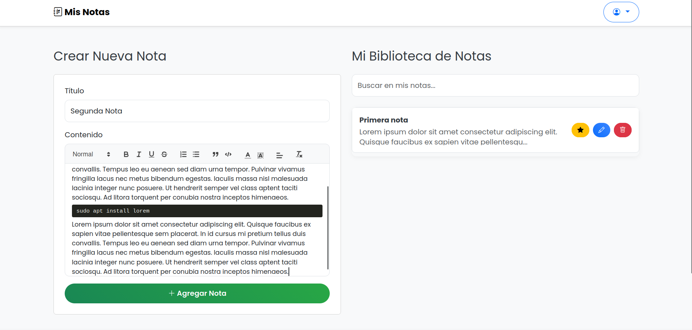
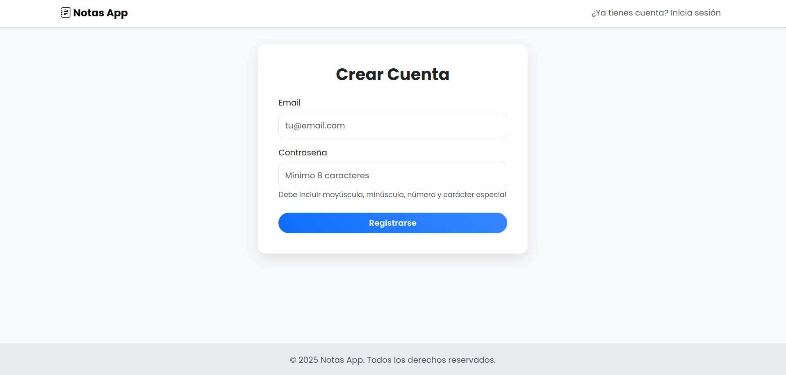
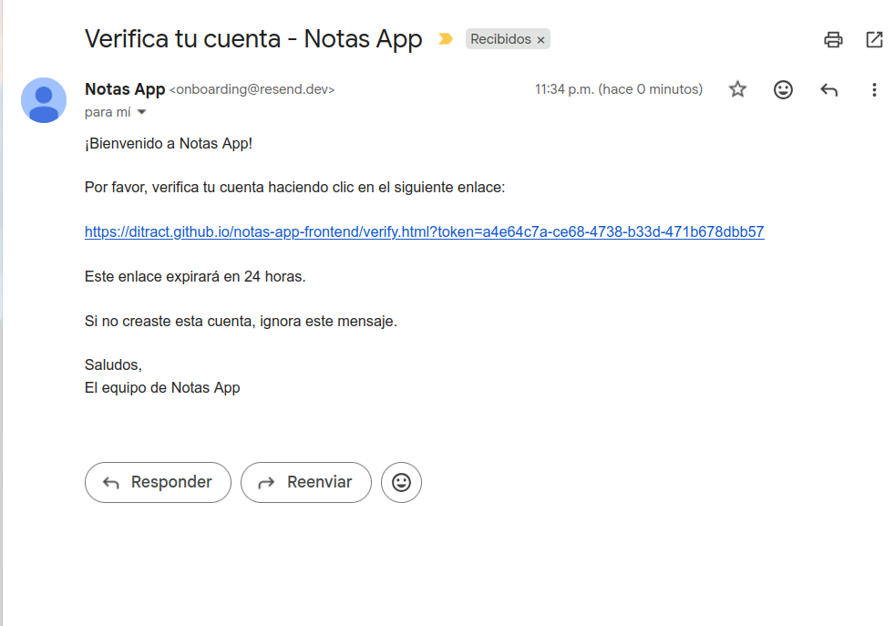
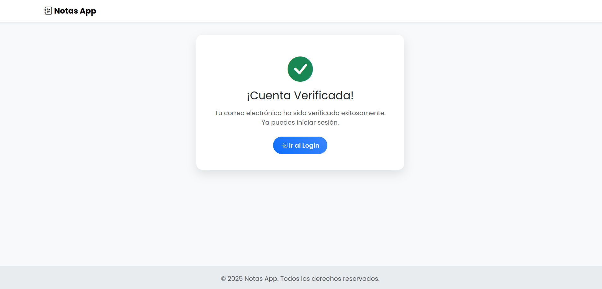
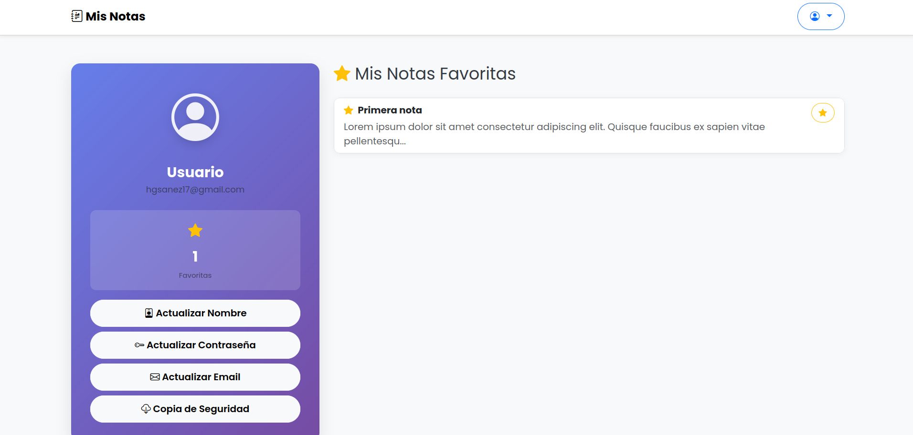

# 📝 Notas App - API REST

> API REST para gestión de notas personales.

[](https://spring.io/projects/spring-boot)
[](https://www.oracle.com/java/)
[](https://www.postgresql.org/)
[](https://jwt.io/)
[](LICENSE)

---

## 📑 Contenido

- [Demo en Vivo](#-demo-en-vivo)
- [Descripción](#-descripción)
- [Capturas de Pantalla](#-capturas-de-pantalla)
- [Características Principales](#-características-principales)
- [Tech Stack](#️-tech-stack)
- [Arquitectura](#-arquitectura)
- [Instalación y Ejecución Local](#-instalación-y-ejecución-local)
- [Uso de la API](#-uso-de-la-api)
- [Próximas Mejoras](#-próximas-mejoras)

---

## 🚀 Demo en Vivo

- **🌐 API Backend:** [https://spring-boot-notes-api.onrender.com](https://spring-boot-notes-api.onrender.com)
- **💻 Frontend:** [https://ditract.github.io/notas-app-frontend/](https://ditract.github.io/notas-app-frontend/)
- **📚 Documentación API (Swagger):** [https://spring-boot-notes-api.onrender.com/swagger-ui/index.html](https://spring-boot-notes-api.onrender.com/swagger-ui/index.html)

> ⚠️ **Nota:** El backend está en Render (plan gratuito) y puede tardar un par de minutos en despertar si no ha recibido tráfico recientemente. Por favor, ten paciencia en la primera carga.

---

## 📖 Descripción

API REST para gestión de notas personales que permite a los usuarios registrarse, autenticarse y administrar sus notas de forma segura. Implementa autenticación JWT, verificación de cuenta por email, recuperación de contraseña y un sistema de notas favoritas.

---

## 📸 Capturas de Pantalla

### Gestión de Notas


### Autenticación





### Perfil


---

## ✨ Características Principales

- 🔐 **Autenticación Completa**: Registro + verificación por email (token 24h) + login JWT (1h) + recuperación de contraseña
- 🔑 **Seguridad robusta**: Contraseñas fuertes, no reutilización de contraseñas anteriores, roles USER/ADMIN, validación de propiedad en notas
- 📝 **CRUD de Notas**: Crear, leer, actualizar y eliminar notas personales
- ⭐ **Sistema de Favoritos**: Marcar/desmarcar notas importantes + verlas directamente en el perfil
- 👤 **Gestión de Perfil**: Actualizar nombre, cambiar contraseña, ver notas favoritas
- 📧 **Emails Transaccionales**: Verificación y reset vía correo
- 👨‍💼 **Panel de Administración**: Gestión de usuarios (Sin frontend por ahora)
- 🧪 **Testing**: 40+ tests unitarios e integración
- 📚 **Documentación**: API documentada con Swagger/OpenAPI 3

---

## 🛠️ Tech Stack

### Backend
- **Framework:** Spring Boot 3.4.2
- **Lenguaje:** Java 17
- **Seguridad:** Spring Security + JWT (jjwt 0.12.6)
- **Base de Datos:** PostgreSQL (Producción) / H2 (Desarrollo)
- **ORM:** Spring Data JPA + Hibernate
- **Validaciones:** Bean Validation (Hibernate Validator)
- **Email:** Spring Mail (Mailtrap dev / Resend prod)
- **Documentación:** Springdoc OpenAPI 3 (Swagger)
- **Testing:** JUnit 5 + Mockito + Spring Boot Test

### Herramientas & Deployment
- **Build Tool:** Maven
- **Containerización:** Docker
- **Deploy:** Render (Backend) + GitHub Pages (Frontend)
- **Perfiles:** Dev (H2 + Mailtrap) / Prod (PostgreSQL + Resend)
- **CORS:** Configurado para localhost y producción

---

## 📁 Arquitectura

El proyecto sigue una **arquitectura en capas** (Layered Architecture) para mantener una clara separación de responsabilidades:

```
📦 Notas App
├── 🎮 Controller Layer    → Endpoints REST
├── 💼 Service Layer       → Lógica de negocio
├── 🗄️  Repository Layer   → Acceso a datos
├── 📊 Model Layer         → Entidades JPA
├── 🔄 DTO Layer           → Transferencia de datos
├── 🛡️  Security Layer     → JWT + Configuración
└── ⚠️  Exception Layer    → Manejo global de errores
```

### Principios y Buenas Prácticas Aplicados
- ✅ Separación de responsabilidades (SoC)
- ✅ Inyección de dependencias
- ✅ DTOs para encapsulación
- ✅ Manejo centralizado de excepciones
- ✅ Validaciones en múltiples capas
- ✅ Código limpio y mantenible


---

## 🚀 Instalación y Ejecución Local

### Prerrequisitos

- **Java 17** o superior
- **Maven 3.6+**
- **Cuenta de Mailtrap** (gratuita) - [Crear cuenta](https://mailtrap.io)
- **Lombok configurado en tu IDE**  
    ⚠️ **Importante:** si no lo tienes configurado verás errores falsos de "no se encuentran getters/setters/constructors" aunque `mvn clean install` funcione.  
    → Ve a https://projectlombok.org/setup para instrucciones rápidas según tu IDE.

> **Nota:** No necesitas instalar una base de datos. El proyecto usa H2 (base de datos en memoria) en desarrollo.

---

### Paso 1: Clonar el Repositorio

```bash
git clone https://github.com/Ditract/notes-app.git
cd notas-app-backend
```

---

### Paso 2: Configurar Mailtrap

1. Ve a [Mailtrap.io](https://mailtrap.io) y crea una cuenta gratuita
2. En tu inbox, ve a **SMTP Settings**
3. Copia las credenciales (username y password)
4. Abre `src/main/resources/application-dev.properties`
5. Actualiza estas líneas con tus credenciales:

```properties
spring.mail.username=TU_MAILTRAP_USERNAME
spring.mail.password=TU_MAILTRAP_PASSWORD
```

---

### Paso 3: Ejecutar la Aplicación

```bash
mvn clean install
mvn spring-boot:run
```

La aplicación estará disponible en:
- **API:** `http://localhost:8080`
- **Swagger UI:** `http://localhost:8080/swagger-ui/index.html`
- **H2 Console:** `http://localhost:8080/h2-console`
    - JDBC URL: `jdbc:h2:mem:testdb`
    - Username: `sa`
    - Password: *(dejar vacío)*

---

### Paso 4: Usuario Administrador

Al iniciar la aplicación, se crea automáticamente un usuario administrador:

- **Email:** `admin@gmail.com`
- **Password:** `Password123?`

Puedes usar estas credenciales para:
- Probar endpoints de administrador en Swagger
- Gestionar usuarios desde `/api/usuarios`

---

### Ejecutar Tests

```bash
# Todos los tests (40 tests)
mvn test

# Tests de una clase específica
mvn test -Dtest=AuthServiceTest

# Con reporte de cobertura
mvn test jacoco:report
```

---

### Dockerización (Opcional)

El proyecto incluye un `Dockerfile` para deployment:

```bash
# Construir imagen
docker build -t notas-app .

# Ejecutar contenedor
docker run -p 8080:8080 \
  -e SPRING_PROFILES_ACTIVE=dev \
  -e MAIL_USERNAME=tu-username \
  -e MAIL_PASSWORD=tu-password \
  notas-app
```

---

## 📚 Uso de la API

### Flujo Básico

1. **Registrarse**: `POST /api/auth/signup`
   ```json
   {
     "email": "usuario@example.com",
     "password": "Password123!"
   }
   ```

2. **Verificar email**: Revisa tu inbox de Mailtrap y copia el token

3. **Verificar cuenta**: `GET /api/auth/verify?token={TOKEN}`

4. **Iniciar sesión**: `POST /api/auth/signin`
   ```json
   {
     "email": "usuario@example.com",
     "password": "Password123!"
   }
   ```

5. **Usar el JWT**: En Swagger, haz clic en **Authorize** y pega el token

### Documentación Completa

Toda la documentación de endpoints está en **Swagger UI**:
- **Local:** [http://localhost:8080/swagger-ui/index.html](http://localhost:8080/swagger-ui/index.html)
- **Producción:** [https://spring-boot-notes-api.onrender.com/swagger-ui/index.html](https://spring-boot-notes-api.onrender.com/swagger-ui/index.html)

---

## 🔧 Perfiles de Spring

El proyecto usa perfiles para diferentes entornos:

| Perfil | Base de Datos | Email    | Uso                      |
|--------|---------------|----------|--------------------------|
| **dev** | H2 (en memoria) | Mailtrap | Desarrollo local         |
| **prod** | PostgreSQL | Resend   | Producción (Render free) |

Por defecto, el perfil **dev** está activo. No necesitas cambiar nada para desarrollo local.

---

## 🚀 Próximas Mejoras

- [ ] Paginación de notas
- [ ] Búsqueda y filtros de notas
- [ ] Categorías/etiquetas para notas
- [ ] Backup de notas
- [ ] Refresh tokens
- [ ] Rate limiting
- [ ] Exportar notas (PDF, TXT)

---


📫 **Contacto:** [LinkedIn](https://www.linkedin.com/in/héctor-gonzález-sanez-871b64383)